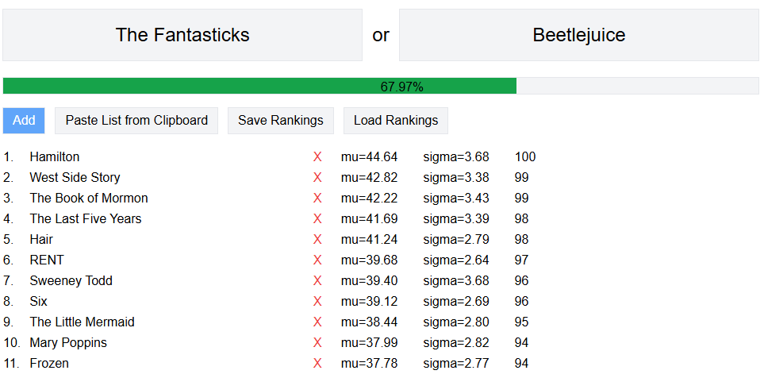

# Trueskill Ranker

_Trueskill ranker_ is an open-source web app that uses the [trueskill ranking system](https://en.wikipedia.org/wiki/TrueSkill) to help you sort a list of items by comparing them **two at a time**. This is an improvement on [elo ranker](https://elo-ranker.glitch.me/) since it prioritizes comparison of items with similar ratings and low "confidence," allowing you to get an **accurate rating much faster**. It also allows you to add a new item to an already ranked list, quickly finding its place.

You can use it to rank your favorite movies, songs, books, TV shows, or even prioritize your tasks or startup ideas!

## How to use it?

Head over to https://trueskill-ranker.vercel.app/ to start ranking your list. To start, you can add items either by using the "Add" button one at a time, or "Paste List from Clipboard" to add multiple items at once by copying a list where each item is on a separate line. _(Note: this function will erase your existing list)_. After adding at least two items, you can start rating them by picking your favorite out of two at a time!

You can also save your rankings to a `.json` file and later load them in another computer or browser.

The progress line indicates the average confidence of the rating. Since 100% accuracy isn't possible, it will never reach 100% but will approach it as sigmas approach 0. Anything above 50-60% is usually good enough to share.

## Sweet! Can I help?

Sure! Pull requests, bug reports, and feature requests are welcome. You can also help by sharing the app with your friends or on social media.
